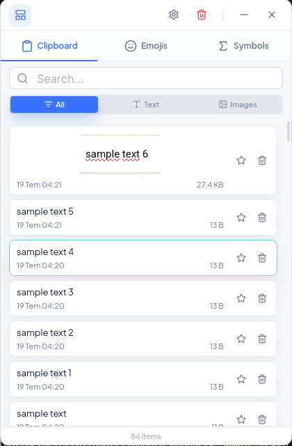
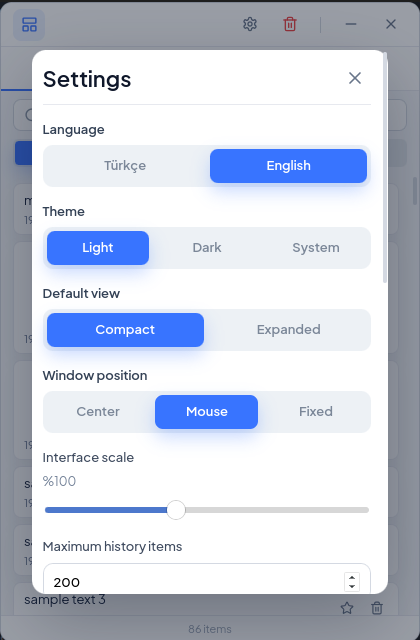
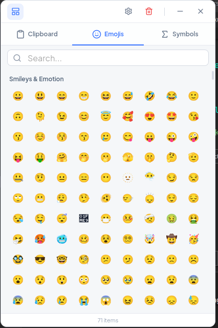
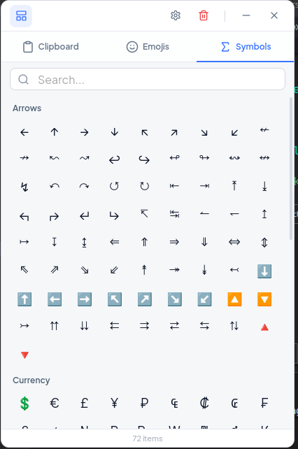

# ClipNest 📋🐦

<p align="center">
  
</p>

<p align="center">
  <a href="https://github.com/salihoz0/ClipNest/blob/main/LICENSE"></a>
  
  
</p>

---

### [English](#english-1) | [Türkçe](#türkçe-1)

---

## English

ClipNest is a modern, fast, and secure clipboard history manager built for Windows, macOS, and Linux (especially Ubuntu/Debian-based systems). It works as a lightweight daemon/application in the background, registering a system tray icon and global hotkeys to let you easily recall, search, and manage your copy history (both text and images).

### 🚀 Key Features
* **Multi-Format History:** Automatically captures and logs copied text, formatted content, and images.
* **Instant Search & Filter:** Quickly filter through history by kind (text, images, favorites) or search contents (or image metadata/dimensions).
* **Keyboard-First Design:** Fully navigable using arrow keys, Esc to hide, and Enter to copy/paste.
* **System Tray Integration:** Quick access, settings configuration, and exit options directly from the taskbar.
* **Auto-Start:** Automatically launches on system boot.
* **Smart Cleanup:** Keeps your system lightweight by trimming history to a configurable limit (and preserves your starred/favorite items).

---

## Türkçe

ClipNest; Windows, macOS ve Linux (özellikle Ubuntu/Debian tabanlı) dağıtımları için tasarlanmış modern, hızlı ve güvenli bir pano geçmişi yöneticisidir. Arka planda hafif bir servis gibi çalışır, sistem tepsisi (tray) entegrasyonu ve küresel kısayol tuşları sayesinde kopyalama geçmişinize (metinler ve görseller) saniyeler içinde erişmenizi ve yönetmenizi sağlar.

### 🚀 Öne Çıkan Özellikler
* **Çoklu Format Desteği:** Kopyalanan tüm metinleri, zengin içerikleri ve görselleri otomatik olarak yakalar ve kaydeder.
* **Anında Arama ve Filtreleme:** Türlerine göre (metin, görsel, favoriler) filtreleme yapın ya da arama çubuğu üzerinden içerik veya görsel boyutları arasında anında arama yapın.
* **Klavye Dostu Arayüz:** Yön tuşlarıyla listede gezinin, Enter ile yapıştırın ve Esc ile pencereyi kapatın.
* **Sistem Tepsisi Entegrasyonu:** Görev çubuğundan hızlı erişim, ayarlar paneli ve uygulamadan çıkış kontrolleri.
* **Otomatik Başlatma (Autostart):** Bilgisayarınız açıldığında arka planda otomatik olarak başlar.
* **Akıllı Temizlik:** Geçmiş sınırını aşan eski ögeleri otomatik temizlerken favori (yıldızlı) ögelerinizi korur.

---

## 📸 Screenshots / Ekran Görüntüleri

<p align="center">
  
  
</p>
<p align="center">
  
  
</p>

---

## ⌨️ Keyboard Navigation / Klavye Kısayolları

| Key / Tuş | Action (English) | İşlem (Türkçe) |
| --- | --- | --- |
| `Super + Shift + V` *(Default)* | Toggle Main Window | Ana Pencereyi Göster/Gizle *(Varsayılan)* |
| `Arrow Down` / `Arrow Up` | Navigate clipboard list | Pano listesinde aşağı/yukarı gezinme |
| `Enter` | Paste selected item to active window | Seçili ögeyi aktif pencereye yapıştır |
| `Escape` | Hide ClipNest window | ClipNest penceresini gizle |

---

## 🛠️ Development & Compilation / Geliştirme ve Derleme

### Prerequisites / Gereksinimler
You need Node.js and Rust installed on your system to compile/run this project.
```bash
# Ubuntu/Debian dependencies
sudo apt update
sudo apt install -y libgtk-3-dev libwebkit2gtk-4.1-dev libayatana-appindicator3-dev build-essential curl wget xdotool
```

### Installation & Run / Kurulum ve Çalıştırma
```bash
# Install NPM dependencies
npm install

# Run in Development mode
npm run tauri:dev

# Build Production Debian Package (.deb)
npm run tauri:build
```

---

## 📄 License / Lisans

This project is licensed under the MIT License - see the [LICENSE](LICENSE) file for details.
Bu proje MIT Lisansı ile lisanslanmıştır - detaylar için [LICENSE](LICENSE) dosyasına göz atabilirsiniz.
