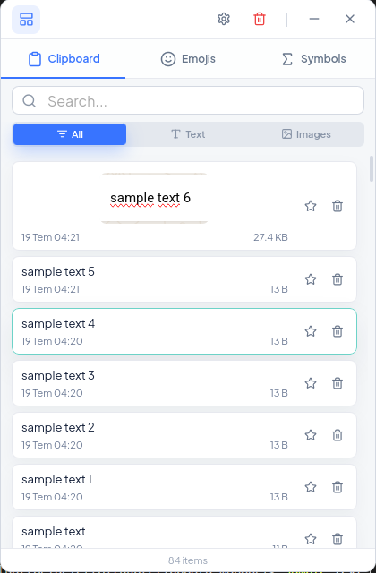
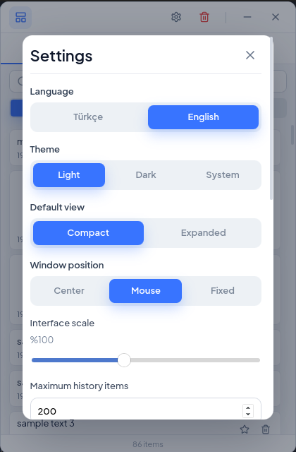
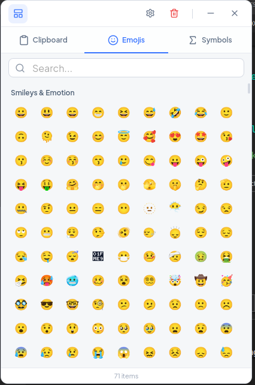
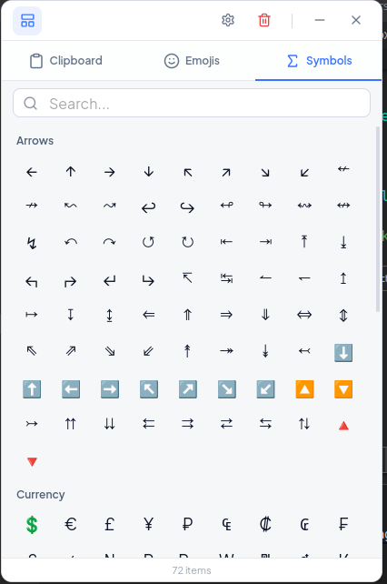

# ClipNest 📋🐦

<p align="center">
  
</p>

<p align="center">
  <a href="https://github.com/salihoz0/ClipNest/blob/main/LICENSE"></a>
  
  
</p>

---

### [English](#english-1) | [Türkçe](#türkçe-1)

---

## English

ClipNest is a modern, fast, and secure clipboard history manager built for Windows, macOS, and Linux (especially Ubuntu/Debian-based systems). It works as a lightweight daemon/application in the background, registering a system tray icon and global hotkeys to let you easily recall, search, and manage your copy history (both text and images).

### 🚀 Key Features
* **Text and Image History:** Automatically captures copied text and images, keeps them searchable, and stores image previews with dimensions.
* **Instant Search and Filters:** Search history content and filter records by all items, text, images, or favorites.
* **Quick Paste:** Select an item with the keyboard or mouse and paste it into the previously active application.
* **Screen OCR:** Select any region of the screen and convert it to text with the local Tesseract OCR engine.
* **Image OCR:** Run OCR on an image already stored in history from its context menu.
* **Local and Privacy-Friendly OCR:** OCR runs on the computer with Turkish and English language data; no cloud service is required.
* **Customizable Shortcuts:** Configure separate global shortcuts for opening ClipNest and starting screen OCR.
* **Emoji and Symbol Picker:** Browse and quickly paste categorized emojis, symbols, arrows, currencies, hearts, and Greek letters.
* **Favorites and Smart Cleanup:** Star important records and automatically trim old history while preserving favorites.
* **System Tray and Auto-Start:** Access the app from the tray and optionally launch it automatically with the system.
* **Themes and Localization:** Use light, dark, or system theme with Turkish and English interface support.
* **Built-in Update Check:** Check for and install available application updates from the settings panel.

---

## Türkçe

ClipNest; Windows, macOS ve Linux (özellikle Ubuntu/Debian tabanlı) dağıtımları için tasarlanmış modern, hızlı ve güvenli bir pano geçmişi yöneticisidir. Arka planda hafif bir servis gibi çalışır, sistem tepsisi (tray) entegrasyonu ve küresel kısayol tuşları sayesinde kopyalama geçmişinize (metinler ve görseller) saniyeler içinde erişmenizi ve yönetmenizi sağlar.

### 🚀 Öne Çıkan Özellikler
* **Metin ve Görsel Geçmişi:** Kopyalanan metinleri ve görselleri otomatik olarak yakalar; arama için saklar ve görsel önizlemeleri ile boyut bilgilerini gösterir.
* **Anında Arama ve Filtreleme:** Geçmiş içeriğinde arama yapın; tüm kayıtları, metinleri, görselleri veya favorileri filtreleyin.
* **Hızlı Yapıştırma:** Klavye veya fareyle bir kayıt seçin ve daha önce aktif olan uygulamaya doğrudan yapıştırın.
* **Ekran OCR:** Ekranın istediğiniz bölümünü seçip yerel Tesseract OCR motoruyla metne dönüştürün.
* **Görsel OCR:** Geçmişte kayıtlı bir görsele sağ tıklayarak OCR çalıştırın.
* **Yerel ve Gizlilik Dostu OCR:** OCR bilgisayar üzerinde Türkçe ve İngilizce dil verileriyle çalışır; bulut servisi gerekmez.
* **Özelleştirilebilir Kısayollar:** ClipNest’i açmak ve ekran OCR’ı başlatmak için ayrı küresel kısayollar belirleyin.
* **Emoji ve Sembol Seçici:** Kategorilere ayrılmış emojileri, sembolleri, okları, para birimlerini, kalpleri ve Yunan harflerini hızlıca yapıştırın.
* **Favoriler ve Akıllı Temizlik:** Önemli kayıtları yıldızlayın; eski geçmişi otomatik temizlerken favorileri koruyun.
* **Sistem Tepsisi ve Otomatik Başlatma:** Uygulamaya tray üzerinden erişin ve sistem açılışında otomatik başlatmayı etkinleştirin.
* **Tema ve Dil Desteği:** Açık, koyu veya sistem temasını; Türkçe ve İngilizce arayüzü kullanın.
* **Uygulama İçi Güncelleme:** Ayarlar panelinden yeni sürümleri kontrol edin ve mevcut güncellemeleri yükleyin.

---

## 📸 Screenshots / Ekran Görüntüleri

<p align="center">
  
  
</p>
<p align="center">
  
  
</p>

---

## ⌨️ Keyboard Navigation / Klavye Kısayolları

| Key / Tuş | Action (English) | İşlem (Türkçe) |
| --- | --- | --- |
| Configured app shortcut *(e.g. `Super + V`)* | Toggle Main Window | Ana pencereyi göster/gizle |
| `Super + Shift + T` *(Default)* | Start screen OCR | Ekran OCR’ı başlat *(Varsayılan)* |
| `Arrow Down` / `Arrow Up` | Navigate clipboard list | Pano listesinde aşağı/yukarı gezinme |
| `Enter` | Paste selected item to active window | Seçili ögeyi aktif pencereye yapıştır |
| `Escape` | Hide ClipNest window | ClipNest penceresini gizle |

---

## 🛠️ Development & Compilation / Geliştirme ve Derleme

### Prerequisites / Gereksinimler
You need Node.js and Rust installed on your system to compile/run this project.
```bash
# Ubuntu/Debian dependencies
sudo apt update
sudo apt install -y libgtk-3-dev libwebkit2gtk-4.1-dev libayatana-appindicator3-dev build-essential curl wget xdotool scrot tesseract-ocr tesseract-ocr-eng tesseract-ocr-tur
```

### Installation & Run / Kurulum ve Çalıştırma
```bash
# Install NPM dependencies
npm install

# Run in Development mode
npm run tauri:dev

# Build Production Debian Package (.deb)
npm run tauri:build
```

---

## 📄 License / Lisans

This project is licensed under the MIT License - see the [LICENSE](LICENSE) file for details.
Bu proje MIT Lisansı ile lisanslanmıştır - detaylar için [LICENSE](LICENSE) dosyasına göz atabilirsiniz.
